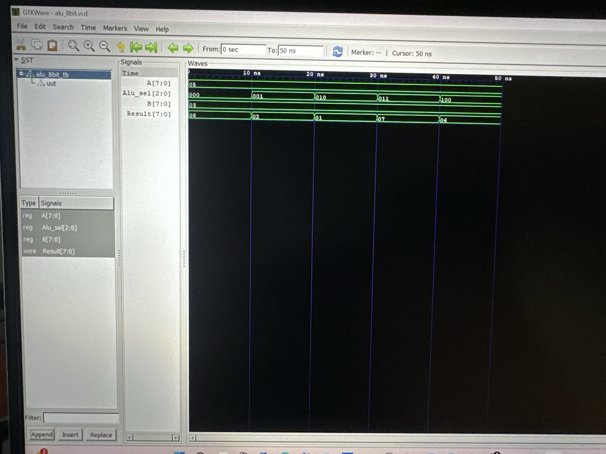

# Digital-Logic-verilog
My Verilog projects for Digital Logic Design and Computer Engineering
# Digital Logic Design in Verilog

## About This Repository

This repository documents my self-directed exploration of digital logic design and Verilog.

Before beginning my formal coursework in this area, I wanted to start learning these concepts independently because of my curiosity about digital hardware and computer engineering. Rather than waiting for my coursework to begin, I started with fundamental digital circuits and progressively worked toward more complex designs.

The repository currently follows this progression:

**Half Adder → Full Adder → 8-bit Arithmetic Logic Unit (ALU)**

For each project, I wrote the Verilog design and a corresponding testbench to simulate and verify its behavior. I used Icarus Verilog for compilation and simulation and GTKWave for waveform analysis.

---

## Projects

### 1. Half Adder

The Half Adder was my starting point for understanding combinational logic in Verilog.

It performs binary addition on two single-bit inputs.

**Inputs**
- `A`
- `B`

**Outputs**
- `Sum`
- `Carry`

I implemented the circuit in Verilog and created a testbench to test its input combinations.

**Files**
- `half_adder.v`
- `half_adder_tb.v`

---

### 2. Full Adder

After implementing the Half Adder, I moved to a Full Adder to understand how an additional carry input can be incorporated into binary addition.

**Inputs**
- `A`
- `B`
- `Cin`

**Outputs**
- `Sum`
- `Cout`

This project helped me build on the concepts from the Half Adder and better understand carry behavior in digital arithmetic.

I also created a Verilog testbench to simulate and verify the design.

**Files**
- `full_adder.v`
- `full_adder_tb.v`

---

### 3. 8-bit Arithmetic Logic Unit (ALU)

After working with the Half Adder and Full Adder, I wanted to explore a more capable digital circuit.

I designed an 8-bit Arithmetic Logic Unit (ALU) that accepts two 8-bit inputs and performs different arithmetic and bitwise operations based on a 3-bit selection input.

**Inputs**
- `A[7:0]`
- `B[7:0]`
- `Alu_sel[2:0]`

**Output**
- `Result[7:0]`

### Supported Operations

| Alu_sel | Operation |
|---------|-----------|
| `000` | Addition |
| `001` | Subtraction |
| `010` | Bitwise AND |
| `011` | Bitwise OR |
| `100` | Bitwise XOR |

For one of my simulations:

- `A = 0x05`
- `B = 0x03`

The ALU produced:

| Operation | Result |
|-----------|--------|
| ADD | `0x08` |
| SUB | `0x02` |
| AND | `0x01` |
| OR | `0x07` |
| XOR | `0x06` |

**Files**
- `alu_8bit.v`
- `alu_8bit_tb.v`

---

## Verification and Simulation

I created testbenches for the designs to apply different inputs and observe the resulting outputs.

I used **Icarus Verilog** to compile and simulate the Verilog designs and generated VCD waveform files for analysis.

I then used **GTKWave** to inspect the signals and visually verify the behavior of the circuits.

### 8-bit ALU Waveform

The ALU simulation shows how `Result` changes as `Alu_sel` selects between addition, subtraction, AND, OR, and XOR operations.

---

## Tools Used

- Verilog HDL
- Icarus Verilog
- GTKWave
- Visual Studio Code
- Git
- GitHub

---

## What I Learned

Building these projects independently helped me gain practical experience with:

- Combinational digital logic
- Verilog module design
- Binary arithmetic
- Arithmetic and bitwise operations
- Testbench development
- Hardware simulation
- VCD waveform generation
- Waveform analysis using GTKWave
- Debugging Verilog designs

More importantly, this process taught me how to approach unfamiliar technical concepts independently: starting with a simple design, testing it, understanding the results, and then building something more complex from that foundation.

These projects represent the beginning of my journey into digital hardware design. I plan to continue developing this foundation as I begin formal coursework in this area and explore more advanced topics in digital design, computer architecture, and hardware systems.